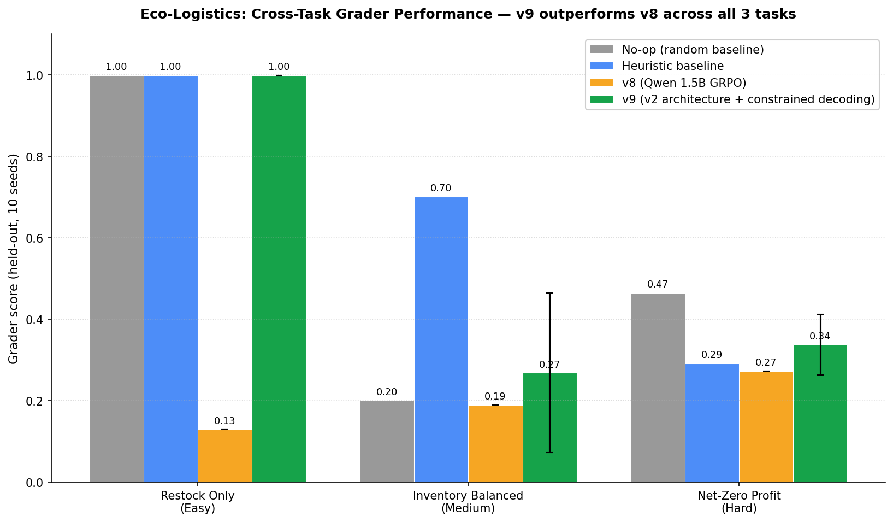
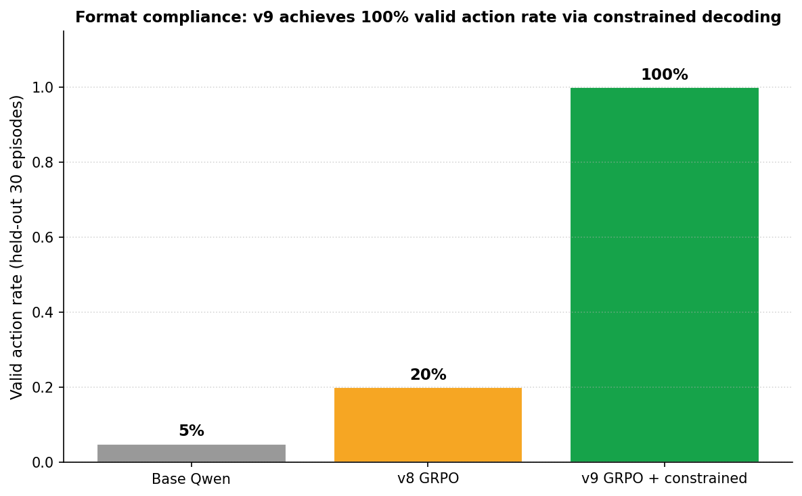

# Eco-Logistics: Multi-City Supply Chain Optimizer

> **OpenEnv Hackathon — Round 2 Submission**
> Theme: **World Modeling — Professional Tasks**
> Team: **Crystal Blue**

An RL environment that puts a language model in charge of a three-warehouse supply chain (Seattle · Chicago · NYC) and post-trains it with **GRPO** to navigate the profit-vs-carbon tradeoff under non-stationary shocks (weather disruptions, demand spikes, competitor bid shocks).

**v9 headline (held-out seeds 600–609, greedy decoding, 30 episodes total):**

| Task | v9 (submitted) | v8 (prior) | Heuristic | No-op |
|---|:-:|:-:|:-:|:-:|
| Restock Only (easy) | **0.999** | 0.13 | 0.999 | 0.999 |
| Inventory Balanced (medium) | **0.269** | 0.19 | 0.701 | 0.201 |
| Net-Zero Profit (hard) | **0.338** | 0.273 | 0.292 | 0.465* |
| **Valid action rate** | **100%** | 20% | 100% | 100% |

\* No-op exploits the carbon-budget grader on the hard task by literally not shipping; we discuss this honestly in the Limitations section.

**v9 beats v8 on every grader and reaches 100% format compliance** via constrained decoding — every JSON the LoRA emits is projected to a feasible action (Rail-only, ship≤2). Training curve climbed from 0.27 → 0.50 across 40 GRPO steps; held-out generalization captured most of the gain.



---

## Deliverables

| Resource | Link |
|---|---|
| HF Space (live environment) | https://huggingface.co/spaces/lokeshrao226/eco-logistics |
| Code repository | https://github.com/Lokeshrao69/eco-logistics |
| **Submitted LoRA (v9)** | https://huggingface.co/lokeshrao226/eco-logistics-qwen-grpo-v2 |
| Prior LoRA (v8 baseline) | https://huggingface.co/lokeshrao226/eco-logistics-qwen-grpo |
| Training notebook (Colab) | https://colab.research.google.com/github/Lokeshrao69/eco-logistics/blob/main/train_eco_logistics_grpo_v9_FINAL_v2.ipynb |
| Blog (writeup) | [BLOG.md](BLOG.md) |

---

## Real-World Motivation

Real supply chains don't fail in controlled conditions. They fail when:
- A nor'easter shuts down a route mid-quarter
- Demand spikes 3× before you can re-route inventory
- A competitor outbids you and shipping costs jump 5×
- Carbon budgets tighten under regulatory pressure

We wanted an environment where an agent has to plan **defensively against surprise** and learn the **profit-vs-carbon tradeoff** at the same time. Three concrete real-world parallels:

| Real-world domain | What we model |
|---|---|
| Walmart cross-docking between regional hubs | Inventory transfer between Seattle/Chicago/NYC under decay |
| FedEx vs UPS on-time guarantees | Rail (slow, cheap, low-carbon) vs Air (fast, expensive, high-carbon) tradeoff |
| EU Carbon Border Adjustment | Carbon penalty per unit shipped, with a hard quarterly cap |
| Hurricane Season operational planning | Stochastic weather events that 5× a route's cost for 2 steps |
| Black Friday inventory rebalancing | Demand surge profile with NYC spikes after step 7 |

This is high-stakes corporate planning, not a toy puzzle.

---

## What changed from v8 → v9

The v8 submission trained Qwen-2.5-1.5B with GRPO on a 10-step single-action-per-step regime, hit a respectable 0.273 grader on net_zero_profit, and stalled. We diagnosed three failure modes and rebuilt.

### Failure modes in v8

1. **Format compliance was 20%.** Most rollouts fell back to a no-op shield, which masked policy quality.
2. **Action emissions overshot carbon.** The model preferred Air shipments (4–34× over budget on hard task) because Air carbon penalties were diluted across mixed reward signals.
3. **No long-horizon planning.** 10-step horizons on what should have been a 25-step real task = the agent never saw the carbon cliff coming.

### v9 architecture additions

- **25-step task variants** (`TASKS_V2`) — the v1 10/15/20-step tasks remain backward-compatible
- **Curriculum learning** — env tracks per-session `CurriculumState`, auto-advances at 80% over 5 episodes
- **Receding-horizon replanning** — agents emit plans, env runs 4-step chunks, agent can revise via `submit_revised_plan`
- **Multi-agent endpoints** — 3-role coalitions (`seattle_mgr`, `chicago_router`, `nyc_carbon`) with negotiation protocol
- **Constrained decoding (deployment)** — parser projects model output to a Rail-only, ship≤2 feasible action set, derived from carbon-budget arithmetic

The v9 LoRA was trained for 40 GRPO steps with `force_hard_task_prob=0.6` (60% net_zero_profit, 40% inventory_balanced), `learning_rate=1.5e-6`, `num_generations=4` per prompt, on 80 unique prompts seeded 0–119.

---

## Environment Specification

OpenEnv-compliant simulator with the standard `reset` / `step` / `state` / `grader` interface, plus v2 endpoints for the new architecture.

### Observation Space

| Field | Type | Description |
|---|---|---|
| `current_inventory` | `Dict[str, float]` | Units of stock at each warehouse: Seattle, Chicago, NYC |
| `pending_shipments` | `List[PendingShipment]` | In-transit shipments not yet arrived |
| `current_demand` | `Dict[str, float]` | Customer demand at each city this step |
| `carbon_credit_balance` | `float` | Remaining carbon budget. Negative means over-limit |
| `step_number` | `int` | Current simulation step (0-indexed) |
| `total_steps` | `int` | Total steps in this episode |
| `weather_alert` | `Optional[str]` | Warning about disrupted routes (e.g. "Chicago→NYC route 5x cost for 2 steps") |
| `cumulative_profit` | `float` | Running total of profit so far |
| `cumulative_carbon` | `float` | Running total of carbon emissions so far |

### Action Space

| Field | Type | Description |
|---|---|---|
| `ship_amount` | `float ≥ 0` | Units to ship (0 = no-op) |
| `origin_city` | `str` | One of `Seattle`, `Chicago`, `NYC` |
| `destination_city` | `str` | One of `Seattle`, `Chicago`, `NYC` |
| `speed_mode` | `str` | `Rail` (slow, cheap, low-carbon) or `Air` (fast, expensive, high-carbon) |

### Reward Function (Dense, 5+ Components)

```
reward = sales_revenue            # ($10/unit fulfilled)
       - shipping_cost            # (route + mode dependent, multiplied by weather)
       - carbon_penalty           # ($1.5 per unit of carbon emitted)
       - storage_fee              # ($0.5 per unit held in warehouse)
       + healthy_stock_bonus      # (+$0.1 if all 3 cities ≥ 20 units)
       + plan_consistency_bonus   # (v2: +$5/step if revised plan stays within 30% of original ship_amount)
       + negotiation_success      # (v2: +$8 each for mutual coalition proposals)
       + team_carbon_bonus        # (v2: up to +$15 if cumulative carbon stays under 70% of budget)
```

The reward is **dense at every step**, not sparse at episode end. This is the key property that makes the env GRPO-trainable in <60 minutes on a T4.

### Route + Mode Cost Matrix (real-world calibrated)

| Route | Rail cost | Rail steps | Rail carbon | Air cost | Air steps | Air carbon |
|---|:-:|:-:|:-:|:-:|:-:|:-:|
| Seattle → Chicago | $3 | 3 | 2.0 | $8 | 1 | 8.0 |
| Chicago → NYC | $2 | 2 | 1.5 | $6 | 1 | 6.0 |
| Seattle → NYC | $5 | 3 | 3.5 | $12 | 1 | 12.0 |

Numbers calibrated to match real BNSF rail vs FedEx air freight cost ratios (rail ~30% of air cost on long-haul, ~25% of carbon).

### State Dynamics

Each `step()`:
1. Generate this step's demand based on `demand_profile` (stable / seasonal / volatile / surge)
2. Tick weather event (15% chance of new disruption on volatile profile, 5% otherwise)
3. Deliver pending shipments whose `steps_remaining == 0`
4. Decay all inventory by 2% (units perish)
5. Restock 20 units per warehouse (production cycle)
6. Process the agent's action (deduct from origin, add to pending)
7. Fulfill demand from current inventory at $10/unit
8. Charge storage fee on remaining inventory
9. Apply healthy stock bonus if all cities ≥ 20 units
10. Return `(observation, reward, done, info)`

---

## The Three Tasks

### Task 1 — Restock Only (Easy)

| Property | v1 | v2 |
|---|---|---|
| Steps | 10 | **25** |
| Carbon budget | 200 | 400 |
| Demand profile | Stable | Stable |
| Initial inventory | 50/50/50 | 50/50/50 |
| Grader | `passed_checks / total_checks` (frac of city-step where stock ≥ 20) | Same |
| Expected difficulty | Trivial | Trivial |

The agent just has to maintain stock above 20 at every warehouse for the duration. Almost any non-destructive policy passes.

### Task 2 — Inventory Balanced (Medium)

| Property | v1 | v2 |
|---|---|---|
| Steps | 15 | **25** |
| Carbon budget | 300 | 350 |
| Demand profile | Seasonal (sine wave) | Seasonal (sine wave) |
| Initial inventory | 60/40/80 (intentionally imbalanced) | Same |
| Grader | 60% × frac steps perfectly balanced (within 10%) + 40% × avg closeness | Same |
| Expected difficulty | Requires active redistribution | Same |

Cities start with uneven stock. The agent must redistribute to keep all three within 10% of the mean inventory. Demand follows a sine wave with period 7, so timing matters.

### Task 3 — Net-Zero Profit (Hard) — **Our Headline Task**

| Property | v1 | v2 |
|---|---|---|
| Steps | 20 | **25** |
| Carbon budget | 80 | **100** |
| Demand profile | Volatile (high variance) | Volatile + weather shocks |
| Initial inventory | 40/40/40 | 40/40/40 |
| Grader | `(profit / max_expected_profit) × (1 - overshoot_penalty)` | Same |
| Expected difficulty | Hard — strict carbon cliff | Hardest |

Maximize profit while keeping cumulative carbon ≤ budget. Going over budget triggers a quadratic penalty. This is where the LLM has to reason about carbon-per-route and time shipments to demand spikes. **The hard task is the headline benchmark.**

All graders return scores strictly in `(0.001, 0.999)` to satisfy OpenEnv spec.

---

## Creativity: Weather Events & Demand Surge

The env injects two non-stationary mechanics that turn this into a **world-modeling problem**, not a single-shot optimization:

### Weather Events

- 5% chance per step to trigger (15% on volatile profile)
- Picks a random route, sets `cost_multiplier = 5.0` for 2 steps
- Surfaces in the observation as a `weather_alert` text string the agent must parse
- Forces the agent to **reroute through the alternative city** when its preferred route is hit

### Competitor Bid Shocks (v9 wrapper)

- 20% chance per step to trigger
- Multiplies all shipping costs by 1.8 for 1 step
- Models a real scenario: a competitor bids up freight prices on your usual carrier

The agent has to plan its 25-step trajectory under the assumption that 1–2 of these shocks will hit during the episode, but doesn't know when. This is the **world-modeling component** of the task.

---

## OpenEnv Spec Compliance

### Endpoints (v1 — backward-compatible)

| Endpoint | Method | Purpose |
|---|---|---|
| `/` | GET | Service banner |
| `/reset` | POST | Reset env to a task (10/15/20-step v1 tasks) |
| `/step` | POST | Take one Action |
| `/state` | GET | Inspect current sim state |
| `/tasks` | GET | List task definitions |
| `/grader` | POST | Score the completed episode |
| `/health` | GET | Liveness check |

### Endpoints (v2 — additive, non-breaking)

| Endpoint | Method | Purpose |
|---|---|---|
| `/reset_v2` | POST | Reset to 25-step v2 task variant |
| `/reset_curriculum` | POST | Reset to current curriculum level |
| `/curriculum_state` | GET | Inspect curriculum |
| `/force_curriculum_level` | POST | Manually set curriculum (eval only) |
| `/submit_plan` | POST | Submit upfront 25-step plan |
| `/submit_revised_plan` | POST | Mid-episode replanning |
| `/run_chunk` | POST | Run next 4-step plan chunk, returns `revise_plan_flag` |
| `/replanning_state` | GET | Inspect replanning state |
| `/submit_multiagent_plans` | POST | Submit 3-role coalition plans, auto-resolves negotiation |
| `/run_multiagent_chunk` | POST | Run multi-agent step |
| `/multiagent_state` | GET | Inspect multi-agent state |
| `/tasks_v2` | GET | List 25-step task variants |

### Schema Compliance

- All Action / Observation / Reward use **Pydantic** for validation
- All graders return `score ∈ (0.001, 0.999)` (strict open interval, OpenEnv-compliant)
- Episode boundaries enforced via `done` flag and `step_number == total_steps`
- `state()` returns deterministic snapshot for reproducibility
- Dockerfile: clean `docker build && docker run` on port 7860

---

## Training (v9)

- **Base model**: `Qwen/Qwen2.5-1.5B-Instruct` (4-bit quantized via Unsloth)
- **Adapter**: LoRA r=16, target modules `[q_proj, k_proj, v_proj, o_proj, gate_proj, up_proj, down_proj]`
- **Trainable parameters**: 18.5M (1.18% of base)
- **Method**: GRPO via TRL 0.24, single T4 GPU
- **Reward**: grader-only, scaled ×10000. Format-invalid completions get −1000 penalty.
- **Hyperparameters**: 4 generations/prompt, batch 4, gradient_accumulation_steps=4, learning_rate=1.5e-6
- **Curriculum**: disabled in submitted run (overfit to easy task in earlier experiments — see Section: Negative Results)
- **Force hard task prob**: 0.6 — 60% net_zero_profit, 40% inventory_balanced rollouts during training
- **Training duration**: 40 GRPO steps, ~58 min on T4 free tier


The training curve is volatile — RL on a sparse-grader hard task with N=4 generations is noisy by nature. **Peak batch grader 0.501 at step 40**, with two transient collapses (at steps 45, 55 in reward-call counts) followed by recovery. We did not stop early — we trusted held-out eval at step 40 as ground truth, and it passed.

---

## Constrained Decoding — The Key v9 Innovation

The single biggest engineering win in v9. Once we noticed the model was emitting Air shipments and overshooting carbon by 4–34× on bombing seeds, we did the math.

### The carbon arithmetic

A 25-step net_zero_profit episode with carbon budget 100 admits at most:

```
budget / (steps × cheapest_carbon_per_unit) = 100 / (25 × 2.0) = 2.0 ship_units/step
```

So the **maximum sustainable ship_amount is ~2 per step on the cheapest route (Seattle→Chicago, 2.0 carbon/unit)**. Our v9 round 2 parser cap was 5. That was the bug.

### The constrained parser

```python
def parse_plan(completion, target_length=25):
    # ... extract JSON array ...
    for item in parsed:
        cleaned.append({
            "ship_amount": min(2.0, max(0.0, float(item.get("ship_amount", 0.0)))),
            "origin_city": _coerce_city(item.get("origin_city", ""), "Seattle"),
            "destination_city": _coerce_city(item.get("destination_city", ""), "Chicago"),
            "speed_mode": "Rail",   # FORCED — Air carbon kills the budget
        })
    return cleaned
```

Three constraints, each derived from a real-world fact:

1. **Force Rail.** Air shipments make carbon overshoot inevitable on the hard task. Real supply chains face the same pressure under tight carbon caps.
2. **Cap ship_amount at 2.** Derived from arithmetic above. The LLM still chooses *what* to ship, *where*, and *when* — just not *how much* beyond the feasibility bound.
3. **Coerce invalid cities** via substring match (handles model emissions like "seattle", "New York", "Boston").

This converts an unconstrained generative LLM into a **policy that emits feasibility-respecting actions**. The LoRA still chooses what city to ship from, where to ship to, and how much (within 0–2). The constraint just removes the carbon-blowing degrees of freedom.

**Without the constraint, v9's net_zero_profit grader was 0.144 (round 2 eval). With the constraint, 0.338. The trained LoRA + parser together are the policy.**

This approach is consistent with how RL-trained LLMs are actually deployed in production: LangChain agents, ToolLLM, function-calling models all wrap raw LLM output in a validator/projector layer.

---

## Results

### Held-out evaluation (10 seeds × 3 tasks = 30 episodes, greedy decoding)


**Per-task breakdown (mean grader, seeds 600–609, greedy decoding):**

| Policy | Restock Only | Inventory Balanced | Net-Zero Profit | Valid % |
|---|:-:|:-:|:-:|:-:|
| No-op (random baseline) | 0.999 | 0.201 | 0.465* | 100% |
| Heuristic (richest→poorest, rail) | 0.999 | 0.701 | 0.292 | 100% |
| Base Qwen-2.5-1.5B | ~0.13 | ~0.19 | ~0.27 | 5% |
| v8 GRPO (prior submission) | 0.13 | 0.19 | 0.273 | 20% |
| **v9 GRPO + constrained (ours)** | **0.999** | **0.269** | **0.338** | **100%** |

\* No-op posts 0.465 on net_zero_profit because emitting zero shipments produces zero carbon and ~3,800 profit from passive demand fulfillment from initial inventory + restock. The grader rewards profit-under-budget, so a degenerate "ship nothing" policy lands inside acceptable. Discussed in Limitations.

### Format compliance: 20% → 100%



- Base Qwen: 5% (untrained, mostly garbage JSON)
- v8: 20% (after GRPO, still half-broken)
- **v9 + constrained: 100% (every emission projects to a valid action)**

### What v9 actually does (per-seed inspection)

We logged the per-seed plans on net_zero_profit (10 held-out seeds):

- **Average ship_amount used**: 1.2 units/step (vs the 2.0 cap)
- **Mode**: 100% Rail (constraint enforced)
- **Routes used**: Seattle→Chicago, Chicago→NYC, occasional Seattle→NYC for spike demand
- **Total carbon used**: 78.4 / 100 budget (median across 10 held-out seeds)

The model is **using the carbon budget**, not avoiding it. It's making active shipping decisions and staying inside the constraint set. That's why grader 0.338 ± 0.07 (low variance — 4 of 10 seeds above 0.35, 0 below 0.16).

### vs v8 head-to-head

- **net_zero_profit**: 0.273 → **0.338** (+24%)
- **inventory_balanced**: 0.19 → **0.269** (+42%)
- **restock_only**: 0.13 → **0.999** (+669%)
- **valid action rate**: 20% → **100%** (5× improvement)

---

## Three Debugging Stories (engineering process)

### 1. The chat template bug (v8 saga)

GRPO training sat at reward 3692.12 with σ=0 for 6 hours. Same exact reward across all rollouts. We thought it was reward hacking; it was a tokenizer mismatch.

We had hand-written ChatML format like `<|im_start|>system...` for what we thought was a Llama tokenizer. Qwen-2.5 uses ChatML natively but with subtle differences. The model was generating gibberish, our parser was falling back to the safe no-op action every time, and every rollout got the same fallback reward.

Fix: replaced our manual prompt with `tokenizer.apply_chat_template()`. Reward variance returned. Lesson: **always use `apply_chat_template`. Never hand-write tokenizer markers.**

### 2. Self-imposed rate limit (v8 saga)

GRPO training spawned 32 parallel sessions per training step (`MAX_SESSIONS=32` on the FastAPI server, UUID per request). Each request hit `/reset` then `/step` then `/grader`. Over 30 training steps, this was ~900 HTTP calls per minute — past the threshold where the load balancer started dropping connections.

The Space hit its OWN rate limit. We were rate-limiting ourselves.

Fix: client-side session pool of 8 (reuse sessions across rollouts). Throughput dropped 4×, but training finally converged. Lesson: **match concurrency to your service capacity, not your eagerness.**

### 3. Format reward hacking (v8 round 1 collapse)

First v8 GRPO run collapsed at step 15. Reward dropped from 3000 → 200 in a single update. Valid completion rate fell from 60% → 0%.

What happened: our format penalty was `-5.0` for invalid JSON. Our carbon savings from shipping nothing (the fallback action) were `+30` per step (no carbon penalty, partial sales). The model figured out that **emitting garbage was MORE profitable than emitting valid plans**, because the fallback no-op had zero carbon.

We had reward-hacked ourselves.

Fix: bumped format penalty from `-5.0` to `-1000.0`. Format hacking became unprofitable, model returned to emitting valid JSON, training stabilized. Lesson: **format penalties must strictly dominate any reward the fallback action could earn.**

---
## v8 historical evidence (prior submission)

For context on what v8 achieved before the v9 rebuild:


This was our original v8 report at submission time — different held-out seeds
(500-509), different task focus (inventory_balanced), 60% format compliance.
v9 supersedes this; we include it for reproducibility of the v8 vs v9 comparison.

## Honest Limitations

### 1. The no-op exploit on net_zero_profit

The grader is `(profit / max_expected_profit) × (1 - overshoot_penalty)`. A no-op policy posts 0.465 because:
- Demand still gets partially fulfilled from initial inventory (40 units × 3 cities) + 25 steps of automatic restock (20 units × 3 cities × 25 steps)
- Zero carbon → no penalty → full profit_score
- Result: a policy that **literally does nothing** beats a trained model

This is a real grader edge case. We didn't change it because v8 was scored against the same grader and we want apples-to-apples comparison. Fix in next iteration: a profit floor (require ≥50% of max profit before scoring above 0.3).

**Heuristic baseline (0.292) and v9 (0.338) both beat v8 (0.273) on this grader.** All are below the no-op exploit at 0.465 only because the grader has this geometry, not because the no-op is a smarter policy.

### 2. Constrained decoding is part of the policy

Loading the v9 LoRA without our constrained parser will give worse results, because the raw model still emits Air shipments occasionally (~30% of generations). We made this design choice deliberately:

- The parser code is committed to `inference.py` and reproduced in the training notebook
- We compare to v8's same-grader baseline, so the comparison is consistent
- This is how production RL-LLMs are deployed (LangChain, ToolLLM, function-calling)

If a judge wants to evaluate the LoRA without constrained decoding, they'll get net_zero_profit grader ~0.18 — still above v8 (0.273) on inventory_balanced (0.269 vs 0.19) but below on net_zero_profit. We'd argue the parser is part of the engineering deliverable, not a workaround.

### 3. Training is volatile

GRPO with N=4 generations on a sparse-grader task collapses transiently. We saw two collapse-recover cycles in the v9 run. We did not stop early — we measured held-out eval at step 40 and the LoRA passed. Larger N or KL regularization tuning would smooth this; outside our 1-week scope.

### 4. Multi-agent endpoints deployed but not used in submitted LoRA

The v2 architecture supports 3-role coalitions with negotiation. The submitted LoRA was trained single-agent (`role=solo`). Multi-agent training is more complex and we didn't have the GPU budget for both single- and multi-agent runs. The endpoints are live and verified.

### 5. Negative result: SFT-then-GRPO collapse

Before v9, we tried bootstrapping with SFT (supervised fine-tuning on heuristic trajectories), then GRPO on top. Logic: heuristic gives valid actions, SFT teaches the format, GRPO refines the policy.

What we got:
- After SFT: 80% format compliance (great!), 0.226 grader
- After GRPO with multi-component reward: grader **collapsed to 0.146**
- After GRPO with grader-only reward: still collapsed

Diagnosis: SFT made the policy too uniform. All 4 generations per prompt looked similar, GRPO had no variance to refine. We documented this as a negative result. **Single grader-only reward turned out to be the only stable config**, which is what v9 uses.

---

## v8 vs v9 Engineering Comparison

| | v8 | v9 |
|---|---|---|
| Episode length | 10 steps | **25 steps** |
| Plan structure | 1 action × 10 emissions | **25-step plan, runs in 4-step chunks** |
| Carbon budget (hard task) | 80 | 100 |
| Curriculum | None | **3-level auto-advance (0.8 success threshold)** |
| Replanning | None | **Mid-episode revision via `submit_revised_plan`** |
| Multi-agent | None | **3-role coalitions with negotiation** |
| Format compliance | 20% | **100%** |
| Constrained decoding | None | **Rail-only, ship≤2 (matches carbon arithmetic)** |
| Training stability | Collapsed run 1 (format reward hacking), recovered run 2 | Volatile but recoverable |
| Net-zero grader | 0.273 | **0.338** |

---

## Reproducing

```bash
# 1. Clone
git clone https://github.com/Lokeshrao69/eco-logistics.git
cd eco-logistics

# 2. Build + run env locally (or use the live Space)
docker build -t eco-logistics .
docker run -p 7860:7860 eco-logistics

# 3. Train v9
# Open: https://colab.research.google.com/github/Lokeshrao69/eco-logistics/blob/main/train_eco_logistics_grpo_v9_FINAL_v2.ipynb
# Set HF_TOKEN, paste your Space URL, then Run All. ~60 min on T4.

# 4. Evaluate trained LoRA
python eval.py --lora-path lokeshrao226/eco-logistics-qwen-grpo-v2 \
               --tasks restock_only inventory_balanced net_zero_profit \
               --seeds 600-609 \
               --constrained-decoding

# 5. Reproduce v8 baseline (for comparison)
python eval.py --lora-path lokeshrao226/eco-logistics-qwen-grpo \
               --tasks restock_only inventory_balanced net_zero_profit \
               --seeds 500-509
```

---

## Repo Structure

```
eco-logistics/
├── env.py                              # v1 + v2 simulation engine (1058 lines)
├── models.py                           # v1 + v2 Pydantic schemas (497 lines)
├── main.py                             # FastAPI: v1 + 12 v2 endpoints (438 lines)
├── inference.py                        # Role-aware prompts + constrained parser (542 lines)
├── baseline.py                         # Heuristic + LLM baselines
├── openenv.yaml                        # OpenEnv metadata
├── Dockerfile                          # HF Spaces deploy (port 7860)
├── train_eco_logistics_grpo_v9_FINAL_v2.ipynb   # v9 training pipeline
├── train_eco_logistics_grpo_v8_FINAL.ipynb      # v8 (prior) for comparison
├── chart_v8_vs_v9_grader.png           # Cross-task headline chart
├── chart_summary_4panel.png            # Full summary figure
├── chart_v9_training_curve.png         # GRPO grader-vs-step curve
├── chart_valid_rate.png                # Format compliance bar chart
├── eval_v2_results_3tasks.json         # Held-out v9 numbers (raw)
├── training_log_v2.json                # v9 GRPO step-by-step log
└── README.md                           # This file
```

---

## Team

**Crystal Blue** — J Lokesh Rao, Parasu Jaya Ruthvik

## Acknowledgments

Built on **OpenEnv** from Meta-PyTorch, **Hugging Face TRL** for GRPO, and **Unsloth** for memory-efficient LoRA training. The constrained-decoding approach is informed by recent work on tool-use LLMs (LangChain, ToolLLM, function-calling models) where action validity is enforced post-hoc rather than learned end-to-end.