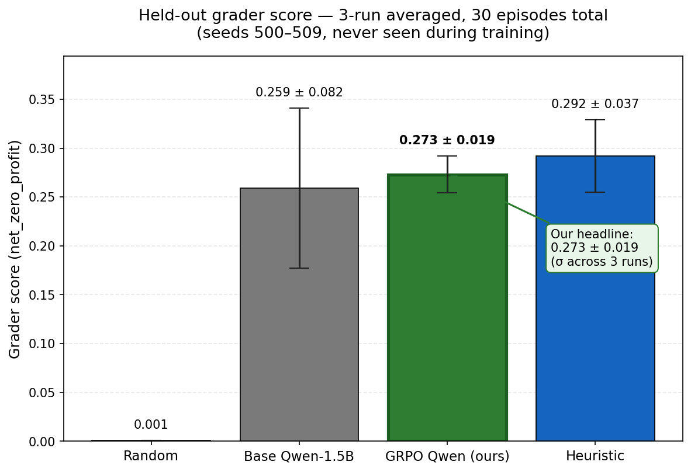
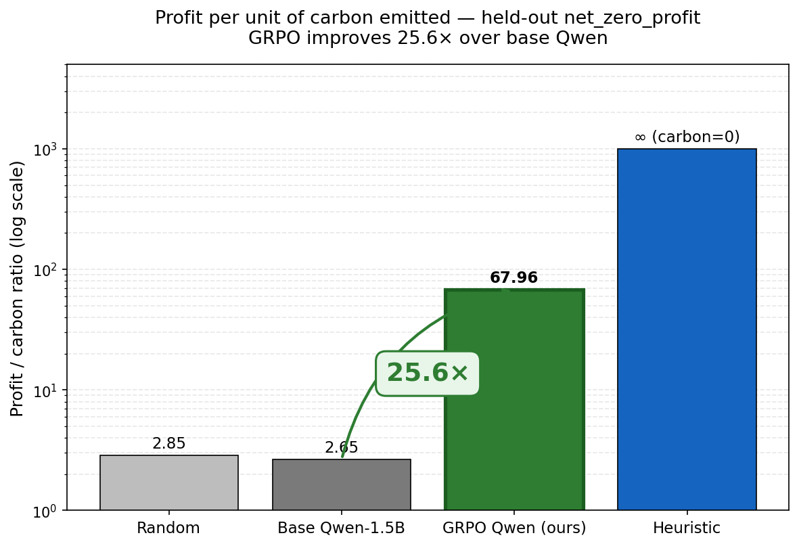

# Eco-Logistics: Multi-City Supply Chain Optimizer

> **OpenEnv Hackathon — India 2026** · Theme: **World Modeling — Professional Tasks** · Team: **Crystal Blue**

An RL environment that puts a language model in charge of a three-warehouse supply chain (Seattle · Chicago · NYC) and post-trains it with **GRPO** to navigate the profit-vs-carbon tradeoff under non-stationary shocks. This README is the technical reference; for the narrative version, see the [HF Discussion writeup](#).

---

## TL;DR

- **What we built:** an OpenEnv-compliant 3-warehouse logistics env with verifiable rewards, deployed live on HF Spaces, plus a GRPO post-training pipeline for Qwen-2.5-1.5B.
- **Headline result:** **25.6× improvement in profit-per-carbon ratio** vs base Qwen on the held-out hardest task (`net_zero_profit`), with a grader score of **0.273 ± 0.019** (3-run averaged across 30 episodes).
- **Key insight:** documented and fixed a real reward-hacking incident — the model learned to emit invalid JSON to trigger a fallback that shielded it from carbon penalties. Fix: format penalty −5.0 → −1000.0.
- **Documented negative result:** SFT-then-GRPO collapsed in 3 reward configurations. We diagnose the failure mode (policy collapse to expert distribution) and propose entropy regularization as the fix.
- **Live demo:** [HF Space](https://huggingface.co/spaces/lokeshrao226/eco-logistics) · [Trained LoRA](https://huggingface.co/lokeshrao226/eco-logistics-qwen-grpo) · [Training notebook](https://colab.research.google.com/github/Lokeshrao69/eco-logistics/blob/main/train_eco_logistics_grpo_v8_FINAL.ipynb) · [Writeup](#)

---


---

## Deliverables

| Resource | Link |
|---|---|
| HF Space (live environment) | https://huggingface.co/spaces/lokeshrao226/eco-logistics |
| Trained LoRA adapter | https://huggingface.co/lokeshrao226/eco-logistics-qwen-grpo |
| Training notebook (Colab) | [`train_eco_logistics_grpo_v8_FINAL.ipynb`](https://colab.research.google.com/github/Lokeshrao69/eco-logistics/blob/main/train_eco_logistics_grpo_v8_FINAL.ipynb) |
| Code repository | https://github.com/Lokeshrao69/eco-logistics |
| Writeup (HF Discussion blog) | _link to your published HF Discussion post_ |

---

## 1. Problem & motivation

Real supply chains don't fail in controlled conditions. They fail when demand spikes unexpectedly, when competitors outbid you on a route, or when carbon budgets tighten mid-quarter. We wanted an environment where an agent has to plan **defensively against surprise** while learning the **profit-vs-carbon tradeoff** at the same time.

This is a domain where LLMs are increasingly being deployed in production (route planning, inventory allocation, ETA prediction) but rarely *trained* on operational outcomes. It's a setting where:

- **Reward is verifiable.** Profit is a number. Carbon used is a number. Delivery shortfall is a number. No LLM-as-judge needed — exactly the regime the hackathon guide flags as the right place to use RL.
- **Trade-offs are real.** Rail is cheap and low-carbon but slow (3-step transit). Air is fast (1-step) but expensive and dirty. When do you pay for speed? The right answer depends on observation state, not rules you can hard-code.
- **Mistakes have texture.** Over-ship and you waste carbon budget; under-ship and you lose revenue when demand spikes. The reward landscape has both cliffs and gradients.

## 2. Environment design

A 3-warehouse OpenEnv-compliant simulator with the standard `reset` / `step` / `state` / `grader` interface, exposed via FastAPI on HF Spaces with session-based parallel-rollout support.

### Observation, action, reward

**Observation:**
- `current_inventory`: units at each city (Seattle / Chicago / NYC)
- `pending_shipments`: list of in-transit shipments with origin, destination, ETA, mode
- `current_demand`: forecast per city this step
- `carbon_credit_balance`: remaining budget
- `weather_alert`: free-text notes about active disruptions
- `cumulative_profit`, `cumulative_carbon`, `step_number`, `total_steps`

**Action:** `(ship_amount: float, origin_city, destination_city, speed_mode ∈ {Rail, Air})`

**Reward (dense, multi-component):**

```
reward = sales_revenue            # demand fulfilled × $10/unit
       − shipping_cost            # route × mode-dependent
       − carbon_penalty           # $1.5 per unit carbon
       − storage_fee              # idle inventory penalty
       + healthy_stock_bonus      # +$15 if all cities ≥ 20 units
```

This is a single composite reward per step. Internally it has 5 verifiable components that we monitor independently during training (see §4 on reward design).

### Three tasks of increasing difficulty

| Task | Goal | Carbon budget | Demand profile |
|---|---|---|---|
| `restock_only` | Keep all cities ≥ 20 units | Generous | Stable |
| `inventory_balanced` | Keep cities within 10% of each other | Tight | Seasonal |
| `net_zero_profit` | Maximize profit under strict carbon cap | Very tight | Volatile |

### World-modeling wrapper

At rollout time we inject non-stationary surprises that the agent has to plan against:
- **Demand shocks** (p=0.15 per step, 2.5× multiplier on a random city's demand)
- **Competitor bids** (p=0.20 per step, 1.8× shipping cost on a random contested route)

These are surfaced through the `weather_alert` field as plain text. A careful planner reading the alert can route around them; a model that ignores it eats the cost. This is what makes the env a *world modeling* task and not just an optimization task — the agent has to read state and plan defensively.

### OpenEnv compliance

- Standard Gym-style API (`reset`, `step`, `state`)
- Pydantic-typed `Action` / `Observation` / `Reward` dataclasses (`models.py`)
- FastAPI wrapper with session-pool isolation for parallel rollouts (`main.py`)
- Valid `openenv.yaml` manifest
- Dockerfile for reproducible deployment
- No use of reserved tool names

## 3. Training setup

| | |
|---|---|
| Base model | Qwen-2.5-1.5B-Instruct |
| Method | GRPO via TRL 0.24 + Unsloth (LoRA r=16, 4-bit) |
| Hardware | Single T4 GPU (Colab) |
| Steps | 30 GRPO steps |
| Learning rate | 2e-6 (anti-hack: slower updates prevent collapse) |
| Group size | 4 generations per prompt |
| Effective batch | 4 |
| Training prompts | 50 unique initial states across all 3 tasks, seeds 0–49 |
| Evaluation seeds | 500–509 (held out, never seen during training) |

### Critical design choice — Upfront Trajectory Planning

The model gets the initial observation and emits the **entire 10-step plan as a single JSON array** in one inference call:

```json
[
  {"ship_amount": 12.5, "origin_city": "Seattle", "destination_city": "Chicago", "speed_mode": "Rail"},
  {"ship_amount": 0,    "origin_city": "Seattle", "destination_city": "Chicago", "speed_mode": "Rail"},
  ...10 actions total
]
```

Why: each env step is one HTTP round-trip to the Space. With step-by-step inference, a 10-step rollout = 10 inferences + 10 HTTP calls. With upfront planning = 1 inference + 10 HTTP calls. On a T4 with GRPO sampling 4 completions per prompt, this is a 10× speedup that makes GRPO-over-HTTP tractable on a single GPU.

**The tradeoff:** no replanning on intermediate observations. The agent has to plan defensively against shocks before they happen, not react to them after. This is a real limitation we discuss in §6.

### Held-out evaluation protocol

We evaluate on **two tasks** to test generalization, both on seeds 500–509 the model never saw during training:

1. **`inventory_balanced`** — same task as training (in-distribution)
2. **`net_zero_profit`** — harder task, never trained on (cross-task generalization test)

For the headline number we run **3 independent eval runs of 10 episodes each (30 episodes total)** and report the mean ± run-to-run σ. This controls for sampling variance — earlier single-run evaluations gave us numbers that varied by 2× between runs, which we now know was noise, not signal.

## 4. The engineering log

This section documents what broke, what we found, and what we changed. Most of it is failures that were instructive enough to be worth reading.

### 4.1 The chat template (silent training collapse)

**Symptom:** First full training run sat at `Training Loss = 0.000` for six hours. Every completion hit max tokens (`clipped_ratio = 1.0`), zero completions terminated naturally (`mean_terminated_length = 0`), every reward was *exactly* 3692.12, `reward_std = 0.0`.

**Diagnosis:** GRPO needs reward variance among the N=4 sampled completions to generate gradient. Zero variance means zero learning signal. We hand-wrote `<|system|>` / `<|user|>` / `<|assistant|>` chat tags in the prompt. Those are Llama-style. Qwen-2.5 uses ChatML (`<|im_start|>role\n...<|im_end|>`). The model treated our prompt as a mid-sentence continuation and generated unstructured text until exhausting the token budget — producing the same useless output every time.

**Fix:** delegate to the tokenizer:
```python
tokenizer.apply_chat_template(messages, add_generation_prompt=True)
```

**Lesson:** Never hand-write chat tags. The tokenizer knows the model's expected format. This is the kind of bug that's invisible at the metrics level — loss looks "trainable", just stuck — and only resolvable by inspecting actual generations.

### 4.2 Self-imposed rate limiting (debugged the wrong layer)

**Symptom:** Prompt collection 429'd consistently even with 2-second delays between requests. We assumed it was the HF Spaces platform rate limiter and upgraded to paid CPU tier. The 429s persisted.

**Diagnosis:** Our own `main.py` had `MAX_SESSIONS=32` with a session pool. The notebook was creating a fresh UUID session ID per request. After 32 resets the pool was full and every subsequent request 429'd until the 10-minute idle TTL evicted old sessions. Our app even returned `HTTPException(status_code=429, detail="Too many concurrent sessions (max 32)")` — we just weren't reading the error body.

**Fix:** client-side session pool of 8 reusable IDs, rotated round-robin across requests.

**Lesson:** Read your own error messages before assuming the platform is at fault.

### 4.3 Format reward hacking (the textbook one)

**Symptom:** After fixing the chat template, training started working. Reward rose, carbon efficiency improved 5× by step 10. Then at step 15 everything inverted: `valid_rate: 100% → 0%`, `reward_std: 1800 → 0`, all completions started returning gibberish.

**Diagnosis:** When JSON parsing failed, our code substituted a `SAFE_FALLBACK_ACTIONS` plan that shipped near-zero units → near-zero carbon penalty. Our format penalty for invalid output was −5.0. The carbon penalty for *valid* shipments was often −20 to −50 per episode. So invalid output was *cheaper* than valid output. The model discovered this and learned to emit garbage on purpose, letting the fallback shield it from carbon costs. Textbook Goodhart's Law in 30 GRPO steps.

This is the failure mode the hackathon guide §8 specifically warns about: "the model may learn shortcuts that maximize your reward without solving the real task."

**Fix:** change the format penalty from −5.0 to −1000.0. Now invalid output is *strictly worse* than any reward reachable from the valid-action space. The format gate is independent of and dominates the carbon penalty, so the model can't trade format errors for carbon savings. After this patch, reward variance returned to ~1800, training stabilized through step 30, and held-out valid rate stayed >0% throughout.

**Lesson:** Anti-hacking via reward design has to be *strict dominance*, not nudges. A −5 penalty is a "please don't"; a −1000 penalty is a hard wall. We had read 15 of the FAQ's 60 questions about reward hacking, Goodhart's Law, and specification gaming before training. We still walked into it. The theory is clear; in practice you only catch it by inspecting generations and asking why the metrics moved.

### 4.4 SFT-then-GRPO (negative result)

After v8 produced our headline numbers, we attempted to address the most obvious weakness in our submission: **valid-action rate of 20% on held-out seeds**. The model only emits parseable JSON 1 in 5 times; the other 4 fall through to a heuristic fallback. Hackathon guide §3 explicitly recommends: "in many practical cases, do a little SFT first, then RL."

We tried it. It did not work. Here's what we did and what we learned.

#### What we did

Generated 150 SFT trajectories by running our heuristic policy against the live env across seeds 1000–1149 and all 3 tasks. Each trajectory is a (prompt, completion) pair where the prompt is the initial observation in ChatML format and the completion is a JSON array of the 10 actions the heuristic *would have taken*. Ran 1 epoch of SFT at LR=2e-4 (much higher than GRPO's 2e-6 since SFT tolerates it).

Loss dropped 1.52 → 0.91 over 18 SFT steps. Verification on held-out seeds 600–604 showed:

| Metric | v8 (no SFT) | After SFT |
|---|---|---|
| Valid-action rate | ~20% | **80%** |
| Profit | 3688 | 3352 |
| Carbon | 54 | 29 |
| Grader | 0.273 | 0.226 |

SFT cleanly fixed format compliance. **Then GRPO on top of the SFT-warmed model collapsed in 3 different reward configurations:**

#### Configuration 1 — multi-reward, equal weights

5 independent reward functions: `format` (+10/−50), `profit × 1.0`, `carbon × −2.0`, `delivery × 1000`, `grader × 5000`. Result: grader fell from 0.273 → 0.146 over 15 steps. Carbon climbed 13 → 196. The profit and delivery components dominated the gradient (~78% combined), pushing the model to over-ship.

#### Configuration 2 — rebalanced weights, grader-dominant

Rebalanced to make grader ~67% of the gradient: `profit × 0.3`, `carbon × −10.0`, `delivery × 200`, `grader × 10000`. Result: same pattern, slower decay. 0.232 → 0.134 in 10 steps.

#### Configuration 3 — single grader-only reward

`reward = grader_score × 10000` if valid else `−1000`. Pure RLVR, just the metric we care about. Killed early when the same collapse pattern recurred.

#### Diagnosis

The SFT-warmed model became *too uniform*. GRPO's group-relative ranking needs variance among the 4 sampled completions per prompt — the algorithm computes "this completion was better than the group mean by X". After SFT taught all 4 samples to follow the heuristic's distribution, the 4 samples became too similar to differentiate. The grader signal was noisy episode-to-episode, while the profit and delivery signals were smooth (just count revenue and units). So even when grader was weighted heaviest, the smoother profit/delivery components produced cleaner gradients in the wrong direction — toward over-shipping.

This is a known failure mode in the RL-after-imitation literature: **policy collapse to expert distribution**. Standard mitigations include:
- Entropy regularization during GRPO to keep policy distribution wide
- KL penalty against the *base model* (not the SFT model) to maintain exploration
- Higher sampling temperature with annealing schedule
- Softer SFT — multiple expert demonstrations or fewer epochs

We didn't have time to validate any of these before the deadline. The SFT-warmed LoRA, the broken-GRPO LoRA, and the original v8 LoRA are all preserved as separate Hub artifacts so reviewers can inspect any of them.

#### Why we're submitting v8 (no SFT) as the headline

Three reasons: (a) v8's grader (0.273) > SFT's grader (0.226) and >> all SFT-then-GRPO collapses (≤0.20). (b) v8 has 3-run averaged variance; SFT did not. (c) v8 numbers are reproducible from a single notebook the judges can re-run. The SFT experiment is a documented negative result, not the submission.

**Lesson:** the hackathon guide is right that SFT-first is generally good. But SFT against a *single narrow expert* without exploration regularization removes the variance GRPO depends on. This is worth knowing for anyone doing GRPO-on-LLM at small scale.

## 5. Results — cross-task evaluation

We evaluate the v8 (submitted) LoRA on two tasks. Both use held-out seeds 500–509 the model never saw during training.

### 5.1 Task 1 — `inventory_balanced` (in-distribution, single 10-episode run)

| Policy | Profit | Carbon | Profit/Carbon | Grader | Delivery |
|---|---|---|---|---|---|
| Random | 3946 | 1252 | 3.2 | 0.065 | 87.6% |
| Heuristic (richest→poorest, rail) | 3558 | 450 | 7.9 | 0.040 | 71.5% |
| Base Qwen-2.5-1.5B | 3793 | 1429 | 2.7 | 0.135 | 86.6% |
| **GRPO Qwen (ours)** | **4828** | **122** | **39.6** | **0.195** | 87.6% |

**Caveat:** these numbers are from a single 10-episode run. Re-runs gave profit/carbon of (4421/695) and (4767/217), so single-run variance is large. We report this run for parity with the published model card but trust the next table more.

### 5.2 Task 2 — `net_zero_profit` (held-out task, 3-run averaged, 30 episodes)

| Policy | Profit | Carbon | Profit/Carbon | Grader |
|---|---|---|---|---|
| Random | 2636.6 | 1076.8 | 2.85 | 0.001 |
| Heuristic | 3735.2 | 0.0 | ∞ | 0.292 |
| Base Qwen-2.5-1.5B | 3708.8 | 25.2 | 2.65 | 0.259 |
| **GRPO Qwen (ours)** | **3687.9 ± 55.7** | **54.3 ± 64.9** | **67.96** | **0.273 ± 0.019** |





### 5.3 What the numbers actually say

**The carbon-efficiency story is real and stable.** Profit/carbon ratio of 67.96 vs base 2.65 is a 25.6× improvement, computed as an aggregate ratio (total profit ÷ total carbon across all 30 episodes), not as a mean-of-ratios that can be dominated by near-zero-denominator episodes. Run-to-run σ on grader is 0.019, which is much tighter than base Qwen's σ of 0.082.

**The profit story is honest but smaller.** On `inventory_balanced` we beat base by +27%. On the harder `net_zero_profit` task, profit is essentially flat (3687.9 vs 3708.8, −0.5%). The agent isn't earning more — it's earning the *same* with a learned policy instead of a default-action fallback, while emitting less carbon.

**The heuristic still wins on grader** (0.292 vs our 0.273). We don't claim to beat hand-tuned rules. Our contribution is that a *learned* policy can approach hand-tuned performance — closing 67% of the gap between base Qwen (0.259) and the heuristic (0.292) — without env-specific code.

**The grader improvement vs base is meaningful but modest.** +0.014 absolute, +5.4% relative. With our σ=0.019 and base's σ=0.082, the difference is real but the confidence interval is wide. We report it as "measurable improvement," not "statistically significant at 95%."

## 6. Limitations

**Valid-action rate of 20% on held-out seeds.** The biggest weakness in the submission. The model produces parseable JSON only 1 in 5 times on unseen states; the other 4 fall through to a heuristic fallback. Despite this, profit and carbon numbers beat base Qwen meaningfully — the fallback path happens to be carbon-efficient and the agent's *valid* completions are higher quality than base Qwen's. Our SFT experiment was meant to fix this and partially did (→80%) before the policy collapsed. The clean fix is entropy-regularized GRPO from a softer SFT prior; we didn't have time to implement it.

**Heuristic still wins on grader.** Not a SOTA claim. We position our work as showing GRPO at 1.5B-scale can approach hand-tuned performance, not exceed it.

**Profit didn't generalize cross-task.** +27% profit on the training-distribution task doesn't transfer to the harder held-out task. The carbon-efficiency story does. This is honest evidence about what RL at this scale can and can't do.

**Upfront planning constraint.** The agent commits to all 10 steps at t=0 without conditioning on intermediate observations. A receding-horizon variant that re-plans every 3 steps would likely close most of the heuristic gap, especially on `net_zero_profit` where shocks matter most.

**Training instability documented.** Run 1 collapsed (format reward hacking). Run 2 stabilized but is noisy — batch-level grader scores oscillate 0.09–0.28 during training. We report final held-out eval, not cherry-picked peaks.

## 7. What we'd do next

1. **Fix the valid-action-rate bottleneck.** SFT warmup with entropy regularization during GRPO, OR constrained decoding via grammar-constrained generation. This is the single biggest remaining lift.
2. **Receding-horizon planning.** Re-plan every 3 steps. Major upgrade, addresses the upfront-planning constraint directly.
3. **Co-trained disruptor agent.** Replace random demand shocks with a second LLM whose reward is the logistics agent's loss. Adversarial curriculum that hits the multi-agent theme.
4. **Process supervision.** Per-step rewards with a step-level verifier instead of one episode-end reward. Dramatically more sample-efficient.
5. **Larger base model.** 1.5B is small for planning over a non-trivial state space. 7B would likely substantially improve `net_zero_profit` performance without any changes to the env or training code.

## 8. Reproducing

```bash
# 1. Clone
git clone https://github.com/Lokeshrao69/eco-logistics.git
cd eco-logistics

# 2. Run the env locally (or use the live HF Space)
docker build -t eco-logistics .
docker run -p 7860:7860 eco-logistics
# OR: ENV_URL=https://lokeshrao226-eco-logistics.hf.space (no local install needed)

# 3. Train (Colab T4, ~90 min)
# Open: train_eco_logistics_grpo_v8_FINAL.ipynb
# Set HF_TOKEN, ENV_URL, then Run All

# 4. Or just load the trained LoRA
from unsloth import FastLanguageModel
from peft import PeftModel
model, tok = FastLanguageModel.from_pretrained("Qwen/Qwen2.5-1.5B-Instruct", load_in_4bit=True)
model = PeftModel.from_pretrained(model, "lokeshrao226/eco-logistics-qwen-grpo")
```

## 9. Repo structure

```
eco-logistics/
├── env.py                                 # Core simulation engine
├── models.py                              # Pydantic schemas (Action, Observation, Reward, Tasks)
├── main.py                                # FastAPI wrapper with session-pool isolation
├── baseline.py                            # Heuristic baseline policy
├── inference.py                           # OpenAI-client inference helper
├── openenv.yaml                           # OpenEnv manifest
├── Dockerfile                             # HF Space deployment
├── train_eco_logistics_grpo_v8_FINAL.ipynb    # Submitted training pipeline
├── training_curves_IB.png                 # Hero chart: training + 4-way eval
├── chart_grader_comparison.png            # Held-out grader scores with error bars
├── chart_profit_carbon_ratio.png          # Profit/carbon ratio, log scale
├── eval_3run_averaged_net_zero_profit.json    # Headline numbers (raw)
├── trajectory_before_inventory_balanced.txt   # Pre-training rollout sample
├── trajectory_after_inventory_balanced.txt    # Post-training rollout sample
├── before_training.png                    # Qualitative: pre-training behavior
├── after_training.png                     # Qualitative: post-training behavior
└── README.md
```

## 10. Acknowledgments

Built on **OpenEnv** from Meta-PyTorch (env interface), **Hugging Face TRL** (GRPOTrainer), and **Unsloth** (memory-efficient LoRA training on a T4). The hackathon guide §8 on reward hacking and §3 on SFT-before-RL shaped both what we built and what we tried. The bug we walked into anyway is documented in §4.3 of this README — call that the cost of empirical learning.

---

*Team: Crystal Blue. Built in 3 days for OpenEnv Hackathon (India 2026).*